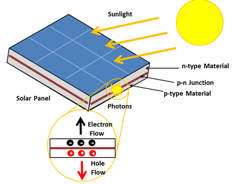

# Solar Tracker

<p>A solar panel produces current whenever light strikes its surface. They are used to collect radiated light energy from the sun and convert them to electric energy. A static solar panel always facing one direction may not receive the same amount of radiation throughout a day as the position of sun with respect to the panel changes due to which a lot of solar energy is missed in a day.</p>
<p>This can be solved by changing the position of the solar panel such that it always faces the sun allowing for maximum radiation exposure throughout the day. The solar panel can be made to track the movement of the sun with the help of a servo motor whose shaft angle can be changes by giving pwm signals from a MCU(Micro Controller Unit).</p>

## What is...
### 1. Solar panel
<p>Photovoltaic cells are semiconductor devices that produce current whenever light carrying photons strikes its surface. These photons carry energy which are converted to electrical energy by a photovoltaic cell. Above a certain radiation level the cell produces a constant voltage across the terminals. The open circuit voltage is higher compared to when a load is connected. The output DC current produced however varies with the amount of radiation the cell receives. The power produced by a cell is equal to the product of its output voltage and current (P=VxI) and is measured in watts.</p>
<p>A solar panel is a collection of such cells connected in series and parallel combinations in order to obtain the required power. The output of such a combination can be used to directly power a load or the energy can be stored in a battery.</p>
</br>
<p align="left">
  
</p>
</br>

### 2. Light dependent resistor(LDR)
A LDR is made of semiconductor material whose resistance to current is dependent on the amount of light falling on its surface. The resistance offered by the LDR decreases as the light falling on its surface increases thereby increasing the current flow which increases the voltage drop acros a resistor connected in series with the LDR. This voltage can be given as input to a MCU to indicate the amount of light falling on it.
</br>
<p align="left">
  
</p>
</br>

### 3. Servo motor
<p>A servo motor is used to rotate an object by rotating its shaft to a specific angle with great precision. It has a feedback system which compares the output angular position of the shaft with its reference position and produces a control signal which changes its angular position until the required position is attained. The gear assembly inside the servo is used to reduce the RPM while increasing the torque.</p>
<p>The servo motor has three wires coming out of it (Vcc,GND and Control). The control signal to the servo motor can be given from a MCU in the form of a PWM signal. The degree of rotation of the motor shaft depends directly on the width of the modulated pulse.</p>
</br>
<p align="left">
  
</p>
</br>

### 4. PWM
<p>Which stands for pulse width modulation is a process of varying the time for which a pulse remains ON. This way the average power delivered by a signal can be controlled. The longer the pulse remains ON compared to its OFF time, the higher the total power supplied to the load.</p>
<p>An Arduino uno has 6 PWM output pins (3,5,6,9,10,11) labeled with ~ sign. PWM signals can be given using the in-built function "analogWrite()" in Arduino IDE.</p>
<p>Duty cyle represents the proportion of ON time of a pulse to its total time period. It is represented in percentage.</p>
</br>
<p align="left">
  
</p>
</br>

## Components and supplies
<ul>
<li>Solar Panel x 1</li>
<li>Light dependent resistor x 2</li>
<li>Servo motor x 1</li>
<li>Arduino Uno X 1</li>
<li>DC motor(generic) X 4</li>
<li>Jumper wires(generic) X 1</li>
<li>L298N motor driver X 1</li>
<li>USB A to B cable X 1</li>
</ul>

## Working
<p>One LDR each is placed on top and bottom of the solar panel. The amount of light falling on each of the LDR is fed ad input to the Arduino Uno used as MCU. The difference between the LDR inputs is found and if it crosses a certain threshold, signals are given to the servo motor using the "Servo.h" Arduino library which rotates its shaft thereby rotating the solar panel until the threshold condition is met ensuring that the solar panel is always facing the radiation source making sure maximum energy is utilized.</p>

## Code
Main code given to Arduino. Rest of the code is in the ir-remote-conrolled-car-code directory.
<details>
<summary>Click to expand code...</summary>
<p>

```c++
#include "pinsUsed.h"
#include <Servo.h>

Servo myServo;  // create servo object to control a servo
// twelve servo objects can be created on most boards

int pos = 0;    // variable to store the servo position
int ldr1_in = 0;
int ldr2_in = 0;
int rad_diff = 0;

void setup() {
  Serial.begin(9600);
  myServo.attach(servo_pin);  // attaches the servo on pin 9 to the servo object
}

void loop() {
  ldr1_in = analogRead(A0); // first ldr output
  ldr2_in = analogRead(A1); // second ldr output

  rad_diff = ldr1_in-ldr2_in; // find the difference between ldr ouputs

  // change servo motor angle if the difference crosses certain threshold
  if(rad_diff>100){
    if(pos>=0){
      pos -=1;
    }
  }
  else if(rad_diff<-100){
    if(pos<=180){
      pos += 1;
    }
  }  
  myServo.write(pos);
  
delay(15);
}
```

</p>
</details>

## References
<ul>
<li>Solar Panel: https://www.alternative-energy-tutorials.com/photovoltaics/photovoltaic-panel.html</li>
<li>LDR: https://www.electronics-notes.com/articles/electronic_components/resistors/light-dependent-resistor-ldr.php</li>
<li>Servo motor: https://circuitdigest.com/article/servo-motor-working-and-basics</li>
<li>PWM: https://create.arduino.cc/projecthub/muhammad-aqib/arduino-pwm-tutorial-ae9d71</li>
<li>L298N: https://lastminuteengineers.com/l298n-dc-stepper-driver-arduino-tutorial/</li>
</ul>
